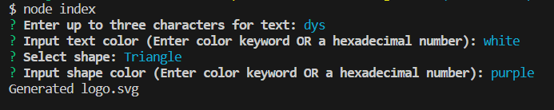

# SVG-Logo-Maker

## Description

This project generates a basic shape logo in the form of a circle, triangle, or square so you have a good base logo or placeholder image for your projects. Handy to have when working on a nav bar, for example.

## Table of Contents

- [Installation](#installation)
- [Usage](#usage)
- [Credits](#credits)
- [License](#license)

## Installation

This project requires Node.js, Jest, and Inquirer to function.   
The inquirer package can be found below:  

https://www.npmjs.com/package/inquirer/v/8.2.4  
Jest package:  
https://www.npmjs.com/package/jest  

## Usage

Run 'node index' to start the application and fill out the command-line prompts to generate a logo!

Here is a video demo of this app in action: 
https://drive.google.com/file/d/1hiM6g9UZswcg2V7FVasoVBrQSZnt7x2t/view 

Input screen:

## Credits

Columbia University Coding Bootcamp

## License

MIT License

## How to Contribute

Follow the [Contributor Covenant](https://www.contributor-covenant.org/)!

## Tests

Included within the lib folder are tests for each shape class. Run them via 'npm test' in the command line. 